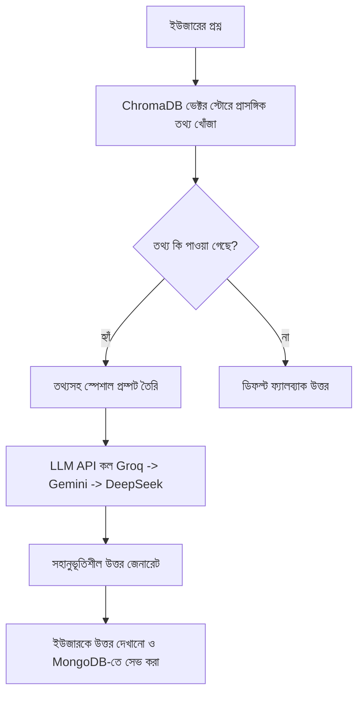

# Mentora LLM চ্যাটবট সিস্টেমের বাংলা গাইড (Beginner Friendly)

Mentora প্ল্যাটফর্মে মানসিক স্বাস্থ্য সহায়তার জন্য মূলত **দুই ধরনের** চ্যাটবট সিস্টেম ব্যবহার করা হয়েছে:
1. **সাধারণ সাপোর্ট চ্যাটবট (Standard Chatbot):** এটি সব ধরনের ব্যবহারকারীর জন্য উন্মুক্ত এবং সরাসরি থার্ড-পার্টি বা লোকাল LLM API কল করার মাধ্যমে সাধারণ চ্যাট সম্পাদন করে।
2. **RAG চ্যাটবট (Retrieval-Augmented Generation Chatbot):** এটি একটি প্রিমিয়াম ফিচার, যা স্থানীয় তথ্যসূত্র (যেমন: মানসিক স্বাস্থ্য সম্পর্কিত গাইড বা FAQ) সার্চ করে সঠিক ও নির্ভরযোগ্য উত্তর তৈরি করে।

নিচে প্রতিটি সিস্টেম, সংশ্লিষ্ট ফাইল এবং পুরো ডাটা ফ্লো সহজ বাংলায় বর্ণনা করা হলো।

---

## ১. সাধারণ সাপোর্ট চ্যাটবট (Standard Chatbot)

এটি মূলত সাধারণ ব্যবহারকারীদের জন্য ২৪/৭ মানসিক সহায়তার কাজ করে। এর জন্য ব্যাকএন্ডে **FastAPI** এবং ফ্রন্টএন্ডে **React** ব্যবহার করা হয়েছে।

### সংশ্লিষ্ট ফাইলসমূহ ও তাদের কাজ:

#### 📂 backend/chatbot/routes/[chatbot.py](file:///home/sakib/Documents/GitHub/Mentora---An-AI-Based-Mental-Health-Self-Awareness/backend/chatbot/routes/chatbot.py)
* **কাজ:** চ্যাটবটের প্রধান API এন্ডপয়েন্ট বা রাউটার।
* **কীভাবে কাজ করে:** 
  - এটি `POST /api/chatbot/chat` এন্ডপয়েন্ট দিয়ে ইউজারের মেসেজ রিসিভ করে।
  - ইউজারের টাইপ অনুযায়ী (ফ্রি নাকি প্রিমিয়াম) সার্ভিস সিলেক্ট করে।
  - ইউজার ফ্রি হলে এটি [Groq API](file:///home/sakib/Documents/GitHub/Mentora---An-AI-Based-Mental-Health-Self-Awareness/backend/chatbot/services/groq_service.py) কল করে, আর প্রিমিয়াম হলে লোকাল [Ollama Service](file:///home/sakib/Documents/GitHub/Mentora---An-AI-Based-Mental-Health-Self-Awareness/backend/chatbot/services/ollama_service.py) কল করে।
  - চ্যাট হিস্ট্রি ট্র্যাক রাখার জন্য MongoDB-এর `chat_sessions` কালেকশনে চ্যাট হিস্ট্রি স্টোর করে।

#### 📂 backend/chatbot/services/[groq_service.py](file:///home/sakib/Documents/GitHub/Mentora---An-AI-Based-Mental-Health-Self-Awareness/backend/chatbot/services/groq_service.py)
* **কাজ:** Groq ক্লাউড API-এর সাথে কানেক্ট করার জন্য ব্যবহৃত সার্ভিস।
* **কীভাবে কাজ করে:** 
  - এটি Llama 3 মডেল (`llama3-8b-8192`) ব্যবহার করে।
  - ইউজার মেসেজ পাঠানোর পর এটি পুরো চ্যাট হিস্ট্রি ফরম্যাট করে Groq API-তে পাঠায় এবং খুব দ্রুত AI জেনারেটেড রেসপন্স এনে দেয়।

#### 📂 backend/chatbot/services/[ollama_service.py](file:///home/sakib/Documents/GitHub/Mentora---An-AI-Based-Mental-Health-Self-Awareness/backend/chatbot/services/ollama_service.py)
* **কাজ:** লোকাল হোস্টে চলা Ollama (মডেল: `tinyllama:latest`)-এর সাথে কানেক্ট করার সার্ভিস।
* **কীভাবে কাজ করে:**
  - এটি ইউজারের মেসেজ বিশ্লেষণ করে ভাষা সনাক্ত করে (বাংলা, বাংলিশ বা ইংরেজি)।
  - ইউজারের ভাষানুযায়ী একটি স্পেশাল প্রম্পট তৈরি করে লোকাল API-তে পাঠায়।
  - **Fallback Mechanism:** যদি Ollama সার্ভিস চালু না থাকে বা সাড়া না দেয়, তবে এখানে নির্দিষ্ট কিছু বাংলা/বাংলিশ কীওয়ার্ডের ভিত্তিতে (যেমন: 'stress', 'mon kharap', 'উদ্বেগ') পূর্বনির্ধারিত সহানুভূতিশীল উত্তর ফেরত দেওয়ার ব্যবস্থা আছে।

#### 📂 frontend/src/pages/[SupportPage.jsx](file:///home/sakib/Documents/GitHub/Mentora---An-AI-Based-Mental-Health-Self-Awareness/frontend/src/pages/SupportPage.jsx)
* **কাজ:** ইউজার ফ্রন্টএন্ডে যে চ্যাট উইন্ডো দেখে তার ডিজাইন এবং লজিক হ্যান্ডেল করে।
* **কীভাবে কাজ করে:**
  - ইউজার টেক্সট বক্সে কিছু লিখে পাঠালে এটি `/api/chatbot/chat` এন্ডপয়েন্টে রিকোয়েস্ট পাঠায়।
  - রেসপন্স আসার পর মেসেজ লিস্ট আপডেট করে স্ক্রিনে দেখায়।

---

## ২. RAG চ্যাটবট (Retrieval-Augmented Generation)

RAG বা রিট্রিভাল-অগমেন্টেড জেনারেশন প্রযুক্তিতে চ্যাটবটটি সরাসরি ইন্টারনেটের তথ্য বা শুধু নিজের ভেতরকার তথ্যের ওপর নির্ভর করে না। বরং এটি আগে থেকে সংরক্ষিত মানসিক স্বাস্থ্যের নির্দেশিকা বা বইপত্র সার্চ করে প্রাসঙ্গিক তথ্য বের করে এবং তা দিয়ে সঠিক উত্তর তৈরি করে।

### RAG কিভাবে কাজ করে (ধাপসমূহ):

### সংশ্লিষ্ট ফাইলসমূহ ও তাদের কাজ:

#### 📂 backend/rag_system/routes/[rag.py](file:///home/sakib/Documents/GitHub/Mentora---An-AI-Based-Mental-Health-Self-Awareness/backend/rag_system/routes/rag.py)
* **কাজ:** RAG চ্যাটবটের রাউটার/API এন্ডপয়েন্ট।
* **প্রধান কাজগুলো:**
  - `POST /api/rag/chat`: ইউজারের মেসেজ নেয় এবং RAG সার্ভিস কল করে। তারপর হিস্ট্রি MongoDB-এর `rag_chat_history`-তে সেভ করে।
  - `GET /api/rag/initialize`: এটি খুবই গুরুত্বপূর্ণ। অ্যাডমিন যখন এই এপিআই কল করে, তখন লোকাল টেক্সট ফাইল (`mental_health_faq.txt`, `depression_tips.txt` ইত্যাদি) রিড করে সেই ডেটা ভেক্টর স্টোরে সংরক্ষণ করে।

#### 📂 backend/rag_system/services/[embedding_service.py](file:///home/sakib/Documents/GitHub/Mentora---An-AI-Based-Mental-Health-Self-Awareness/backend/rag_system/services/embedding_service.py)
* **কাজ:** যেকোনো টেক্সট বা বাক্যকে গানিতিক ভেক্টরে (Numbers) রূপান্তর করে।
* **কীভাবে কাজ করে:** 
  - এটি `paraphrase-multilingual-MiniLM-L12-v2` মডেল ব্যবহার করে টেক্সটকে ৩৮৪ মাত্রার ভেক্টরে রূপান্তর করে।
  - এর মাধ্যমে বাংলা বা ইংরেজি উভয় ভাষার লেখার অর্থ বিশ্লেষণ করা সহজ হয়।

#### 📂 backend/rag_system/services/[vector_store.py](file:///home/sakib/Documents/GitHub/Mentora---An-AI-Based-Mental-Health-Self-Awareness/backend/rag_system/services/vector_store.py)
* **কাজ:** ভেক্টর ডেটাবেজ **ChromaDB** ম্যানেজ করা।
* **কীভাবে কাজ করে:**
  - এটি লোকাল `chroma_db` ফোল্ডারে ডেটা সেভ রাখে।
  - যখন নতুন কোনো মানসিক স্বাস্থ্যের আর্টিকেল অ্যাড করা হয়, তখন তার ভেক্টর এমবেডিং তৈরি করে এখানে সেভ করে।
  - সার্চ ফাংশনের মাধ্যমে ইউজারের প্রশ্নের সাথে সাদৃশ্যপূর্ণ বা সবচেয়ে কাছাকাছি তথ্যের অনুচ্ছেদগুলো খুঁজে বের করে।

#### 📂 backend/rag_system/services/[rag_service.py](file:///home/sakib/Documents/GitHub/Mentora---An-AI-Based-Mental-Health-Self-Awareness/backend/rag_system/services/rag_service.py)
* **কাজ:** RAG সিস্টেমের আসল মস্তিস্ক (Orchestrator)।
* **কীভাবে কাজ করে:**
  - ইউজার কোনো প্রশ্ন করলে এটি প্রথমে `vector_store.search` কল করে ৩-৫টি প্রাসঙ্গিক প্যারাগ্রাফ খুঁজে আনে।
  - এরপর এটি একটি প্রম্পট সাজায়: `"এই তথ্যের ওপর ভিত্তি করে ইউজারের প্রশ্নের উত্তর দাও..."`।
  - **Multi-LLM Auto Fallback:** ব্যাকআপ নিশ্চিত করতে এটি ৩টি ভিন্ন প্রোভাইডার চেক করে। প্রথমে **Groq** দিয়ে চেষ্টা করে, সেটি ব্যর্থ হলে **Gemini** দিয়ে এবং সেটিও ব্যর্থ হলে **DeepSeek** দিয়ে চেষ্টা করে।
  - যদি কোনো এপিআই-ই কাজ না করে, তখন এটি কোডে থাকা লোকাল `_get_fallback_response` ফাংশন থেকে রিলেটেড কোনো প্রিসেট মেসেজ পাঠায়।

#### 📂 frontend/src/pages/[RAGChatbotPage.jsx](file:///home/sakib/Documents/GitHub/Mentora---An-AI-Based-Mental-Health-Self-Awareness/frontend/src/pages/RAGChatbotPage.jsx)
* **কাজ:** RAG চ্যাটবটের ফ্রন্টএন্ড স্ক্রিন।
* **কীভাবে কাজ করে:**
  - শুধুমাত্র প্রিমিয়াম মেম্বাররাই এই পৃষ্ঠা অ্যাক্সেস করতে পারেন। অন্যথায় একটি পেওয়াল (Paywall) দেখা যায়।
  - এটি `/api/rag/chat` এন্ডপয়েন্টের সাথে যোগাযোগ করে চ্যাট হিস্ট্রি এবং বটের রেফারেন্স সোর্স বা সোর্স আর্টিকেল প্রদর্শন করে।

---

## শুরু করার জন্য সাধারণ পরামর্শ (Tips for Beginners)

১. **API Keys:** RAG সিস্টেম ও স্ট্যান্ডার্ড চ্যাটবট ঠিকঠাক রান করতে ব্যাকএন্ডের `.env` ফাইলে অবশ্যই `GROQ_API_KEY`, `GEMINI_API_KEY` (কিংবা লোকাল Ollama সার্ভিস) কনফিগার করা থাকতে হবে।
২. **MongoDB & ChromaDB:** চ্যাট হিস্ট্রি সেভ হয় MongoDB-তে এবং RAG ডকুমেন্টগুলোর ম্যাপিং সেভ থাকে লোকাল ChromaDB ভেক্টর স্টোরে।
৩. **Testing Endpoint:** কোনো কোড পরিবর্তন করার পর প্রথমে `POST /api/chatbot/chat` এবং `POST /api/rag/chat` রিকোয়েস্ট পাঠিয়ে টেস্ট করতে পারেন।
